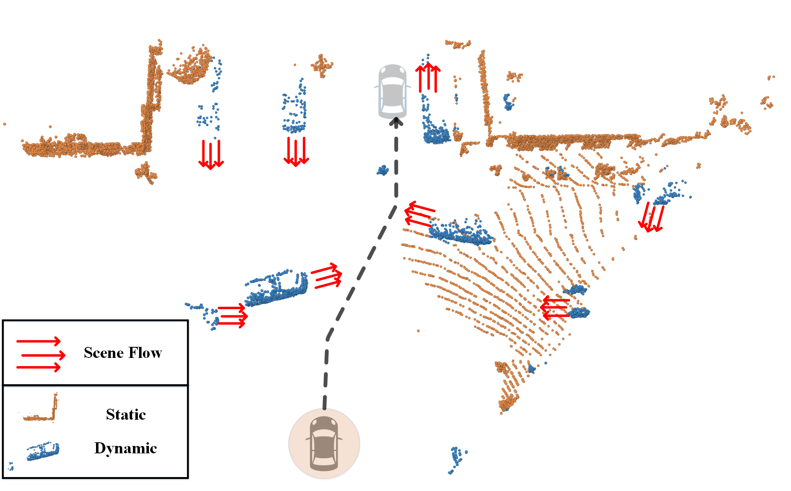
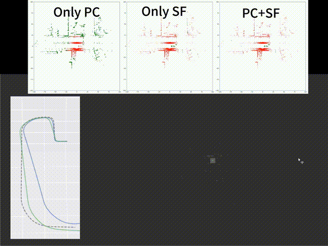

## SSF-SLAM: Semantic Scene Flow-Based SLAM for Dynamic Traffic Scenes

Yinqi Chen, Meiying Zhang, Rui Ma, Qi Hao


### Overview

This work realizes a SLAM framework that uses semantic scene flow to improve traffic scene understanding while reducing the impact of moving objects. By combining scene flow data, we can more accurately separate moving and stationary objects. In turn, this better segmentation helps us estimate scene flow more precisely. The end result is that both scene flow estimation and object segmentation become more accurate, leading to better positioning and local map creation. Our experiments show that this SLAM framework performs better because it uses more precise scene flow data and removes moving objects. In the future, we plan to use learning methods to further improve the integration of scene flow and semantic segmentation, aiming for even better co-estimation with less computing power needed.

<p align="center"> </a> </p>

## 1. Environment

Before this, please ensure that you have installed the environment for the following two open-source codes (this work is developed based on them).

* [ActiveSceneFlow(ASF)_CARLA](https://github.com/SJWang2015/ActiveSceneFlow_CARLA): [Github](https://github.com/SJWang2015/ActiveSceneFlow_CARLA.git)
* [S-LOAM](https://github.com/SJWang2015/ActiveSceneFlow_CARLA): [Github](https://github.com/haocaichao/S-LOAM.git)

Please  install a **GPU-supported pytorch** version which fits your machine.
We have tested with pytorch 1.9.0.

Install PointNet2 CPP lib by yourself:

```shell script
cd pointnet2
python setup.py install
cd ..
```

Install other dependencies:

```shell script
pip install -r requirements
```


## 2. Data preparation

### (1) CARLA_Scene Flow

Please download from links provided by [SUSCape](https://suscape.net)  and refer to the usage instructions of ASF.


## 3. How to run

### ROS

```shell script
# Please install ROS1 and then  
roscore
```

### After training ASF

```shell script
# Ground Truth Example
roslaunch sloam run_Seg.launch RESULT_PATH:="{Result_Path}.tum" DATASET_PATH:=".../carla_scene_flow2/train/record2023_0410_1057/rm_road/SF/00"

# ASF Example
roslaunch sloam run_noSeg_ActiveSceneFlow.launch RESULT_PATH:="{Result_Path}.tum" DATASET_PATH:=".../carla_scene_flow2/train/record2023_0410_1057/rm_road/SF/00"
```


### Evaluation

You need to install [evo]( https://github.com/MichaelGrupp/evo.git ) tool and convert *.tum to *.kitti

```shell script
# EXAMPLE 
evo_traj kitti 00_Seg.kitti 00_onlyPC.kitti 00_SF.kitti 00_SSF.kitti --ref=00_Seg.kitti  -p
```


# 4.Visualizaiton Videos


## Acknowledgements

Some code is borrowed from:

- [Active Scene Flow](https://github.com/SJWang2015/ActiveSceneFlow_CARLA.git)
- [S-LOAM](https://github.com/haocaichao/S-LOAM.git)
- [evo]( https://github.com/MichaelGrupp/evo.git )
- [pointnet2](https://github.com/charlesq34/pointnet2.git)